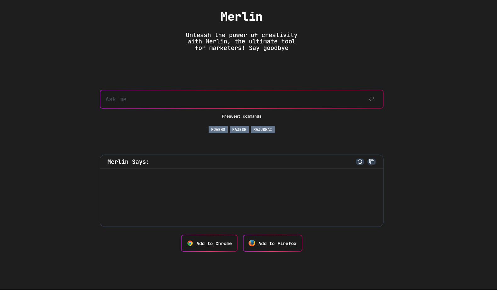

# Merlin

Merlin has a revolutionary new UI for using OpenAI's ChatGPT on all your favourite sites. For example Google Search, Gmail, LinkedIn, Github and everywhere else you search or write online.

## How to use Merlin

To use merlin Click the refresh button to get a new prompt. Then type your response and click the send button to send it to OpenAI. You can also click the refresh button to get a new prompt.
Since the server respond with only data the query for different input has been temporarily disabled.

## Image of the website with the refresh button and the send button

## How to contribute

Merlin is open source and you can contribute to the project by forking the repository and submitting a pull request. You can also submit issues and feature requests.

## How to run Merlin locally

To run Merlin locally, you need to clone the repository and install the dependencies. You can do this by running the following commands:

    git clone
    cd merlin
    npm install

Once you've installed the dependencies, you can run Merlin by running the following command:

        npm run dev

## How to build Merlin

To build Merlin, you need to run the following command:

    npm run build

## How to test Merlin

To test Merlin, you need to run the following command:

    npm run test

## How to deploy Merlin

To deploy Merlin, you need to run the following command:

    npm run deploy

## How to publish Merlin

To publish Merlin, you need to run the following command:

    npm run publish

## How to release Merlin

    npm run release

## How to lint Merlin

    npm run lint
